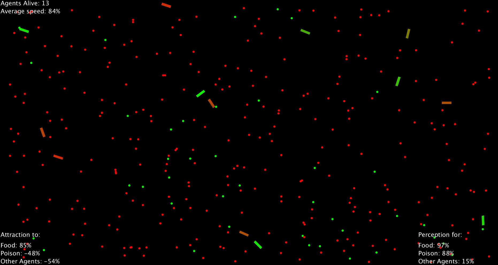

# Genetic-Algorithm-Steering

A population of agents evolves inside an environment that contains food ( green dots) and poison ( red dots ).
In every frame each agent loses some health, the population has to evolve the best combination of DNA parameters to survive.
Each agent, while alive, has a set propability of making a clone of himself. The clone has a chance of mutating his genes.

### The DNA parameters are :
- 3 parameters for Vision Range (how far can they see food, poison and other agents).
- 3 parameters for Attraction(how strongly are they attracted to food, poison and other agents).  
- 1 parameter for speed.

## The Results: 
- After some time has passed the average speed of the agents gets close to 100% of the allowed max speed.
- Visibility range for food gets close to 100% as well as attraction to food. (agents loose health every frame so food is a top priority).
- Visibility for poison most of the times is lower than 55-65% while repulsion from poison rises.(Agents don't want to see poison  from afar because the repulsion force can keep them away from food).
- Agents choose to avoid other agents since food is not shared.
   They are usually repelled from other agents at  50% of the maxforce and they "see" other agents at a 50% range).
   By choosing these percentages they manage to both secure food for themselves and avoid intefering with another agent's hunt for food. 
   Each agent marks an area where he wants to operate alone.
- If the initial population is too big and the environment can't produce enough food for the population the agents
  choose to stay together in case their neighbours die so that they can eat them.

